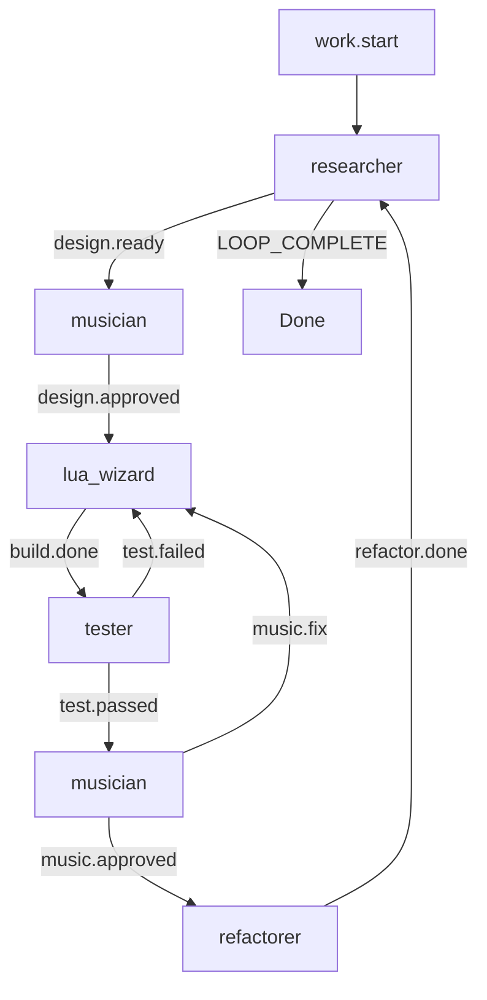

# Design: ralph.yml for re.kriate

## Overview

A Ralph orchestrator configuration that loops five hats — researcher, musician, lua_wizard, refactorer, tester — to autonomously build a norns/seamstress kria sequencer. The loop has two phases: an initial design phase where researcher, musician, and lua wizard collaborate on the plan, then a build/iterate phase that cycles implementation, testing, musical evaluation, and tidying until the sequencer reaches feature parity with kria.

## Detailed Requirements

- **5 hats:** researcher, musician, lua_wizard, refactorer, tester
- **Event loop:** autonomous, high iteration count (100)
- **Seamstress as primary target:** seamstress 2.0 is installed locally with busted test support; norns compatibility maintained but seamstress enables local testing
- **Completion:** researcher confirms feature parity with kria, musician signs off
- **nb voice support:** use the nb voice system for output
- **Composability:** design for use alongside other norns scripts (e.g. timeparty)
- **Simplicity:** the overriding principle

## Architecture: Event Flow



### Phase 1 — Design (first iteration)

1. **researcher** activates on `work.start`. Studies reference implementations, norns/seamstress APIs, sequins, timelines, nb. Writes findings to `specs/` or `docs/`. Emits `design.ready`.
2. **musician** activates on `design.ready`. Reviews research, adds musical requirements (nb support, simplicity, composability). Emits `design.approved` with implementation priorities.
3. **lua_wizard** activates on `design.approved`. Creates the module structure, writes initial code. Emits `build.done`.

### Phase 2 — Build/Iterate (subsequent iterations)

4. **tester** activates on `build.done`. Runs seamstress tests (busted), checks Lua syntax, validates module structure, ctx pattern, no global leaks. Emits `test.passed` or `test.failed`.
5. On `test.failed`: **lua_wizard** fixes and re-emits `build.done`.
6. On `test.passed`: **musician** evaluates from musical perspective. Emits `music.approved` or `music.fix`.
7. On `music.fix`: **lua_wizard** addresses musical feedback, re-emits `build.done`.
8. On `music.approved`: **refactorer** tidies code, enforces conventions, simplifies. Emits `refactor.done`.
9. On `refactor.done`: **researcher** re-activates. Assesses progress against kria feature set. If complete and musician has signed off, emits `LOOP_COMPLETE`. Otherwise emits `design.ready` with next priorities.

## Components

### researcher
- **Role:** Domain expert on kria behavior and norns/seamstress platform
- **Sources:** Reference repos (ansible, n.kria, monome-rack), norns source/stdlib, seamstress docs, sequins/timelines, kria behavioral descriptions
- **Web use:** Careful, targeted — fetch specific docs/source files, not broad searches
- **Output:** Research notes, progress assessments, feature parity tracking
- **Triggers:** `work.start`, `refactor.done`
- **Publishes:** `design.ready`, `LOOP_COMPLETE`

### musician
- **Role:** Opinionated domain evaluator
- **Priorities:** nb voice support, composability with scripts like timeparty, simplicity above all
- **Evaluates:** Musical correctness, UX of sequencer behavior, whether defaults are sensible
- **Triggers:** `design.ready`, `test.passed`
- **Publishes:** `design.approved`, `music.approved`, `music.fix`

### lua_wizard
- **Role:** Primary implementer
- **Expertise:** Norns Lua, seamstress, sequins, timelines, screen/grid UI, nb
- **Conventions:** ctx pattern, no custom globals, thin global hooks, modules via require
- **Triggers:** `design.approved`, `music.approved` (first iteration), `test.failed`, `music.fix`
- **Publishes:** `build.done`

### refactorer
- **Role:** Periodic code hygiene
- **Focus:** Simplicity, ctx pattern enforcement, module boundaries, no dead code, clean interfaces
- **Triggers:** `music.approved`
- **Publishes:** `refactor.done`

### tester
- **Role:** Automated validation
- **Tools:** seamstress `--test` with busted, Lua syntax checks, structural validation
- **Checks:** Script loads, modules return tables, no global leaks, ctx pattern followed, tests pass
- **Triggers:** `build.done`
- **Publishes:** `test.passed`, `test.failed`

## Config Structure

```yaml
cli:
  backend: "claude"

event_loop:
  prompt_file: "PROMPT.md"
  starting_event: "work.start"
  completion_promise: "LOOP_COMPLETE"
  max_iterations: 100

hats:
  researcher: { ... }
  musician: { ... }
  lua_wizard: { ... }
  tester: { ... }
  refactorer: { ... }
```

## Acceptance Criteria

- **Given** a fresh repo with CLAUDE.md and README.md, **when** `ralph run` executes, **then** the researcher hat activates first and studies kria references
- **Given** researcher findings, **when** musician evaluates, **then** it prioritizes nb support and simplicity
- **Given** design approval, **when** lua_wizard implements, **then** code follows ctx pattern with no custom globals
- **Given** implementation, **when** tester runs, **then** seamstress busted tests execute and structural checks pass
- **Given** all tests pass and musician approves, **when** refactorer runs, **then** code is tidied without breaking functionality
- **Given** feature parity with kria confirmed by researcher and musician sign-off, **then** LOOP_COMPLETE is emitted

## Testing Strategy

- Seamstress busted tests for core sequencer logic
- Lua syntax validation (`luac -p` or equivalent)
- Module structure checks (no global pollution, modules return tables)
- Dual-target compatibility: code should load on both seamstress and norns
