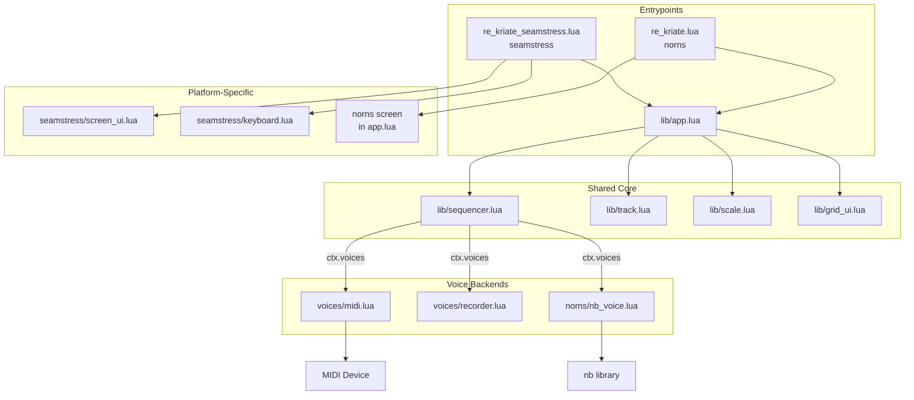

# Design: Seamstress Entrypoint for re.kriate

## Overview

Add seamstress as a first-class platform for re.kriate, the kria-inspired polymetric sequencer. This means a new seamstress entrypoint script, a voice abstraction layer replacing nb, a minimal screen UI, keyboard fallback controls, and tests validating the whole thing works.

**Success criterion:** Load the script in seamstress, connect a grid, and have kria come up working — steps advancing, notes playing over MIDI.

**What this does NOT include:** Full interactive screen UI, nb compatibility shim, general plugin system, pattern storage, direction modes, or any features beyond what the current norns version already has. Those are planned future work.

## Detailed Requirements

### Core
1. Seamstress entrypoint (`re_kriate_seamstress.lua`) that launches the full kria sequencer
2. Voice abstraction layer with MIDI backend — `ctx.voices[track_num]:play_note(note, vel, dur)`
3. Shared `lib/` modules refactored so both norns and seamstress entrypoints can use them
4. The norns entrypoint continues working (wraps nb players into the voice interface)

### Voice System
5. Voice interface: `play_note(note, vel, dur)`, `note_on(note, vel)`, `note_off(note)`, `all_notes_off()`
6. MIDI voice backend with note-off timing via `clock.run` + `clock.sync`
7. Active note tracking with retrigger handling (cancel pending note-off, re-send note-on)
8. CC 123 all-notes-off safety on stop and cleanup
9. Configuration: one MIDI device (global) + channel per track (params), designed for per-track devices later
10. OSC voice backend (deferred — architecture supports it, implementation comes after MIDI works)

### UI
11. Minimal seamstress screen: track name, active page, play state (like current norns screen but in color)
12. Keyboard fallback: play/stop, track select, page select, reset — demoable without grid
13. Grid UI: unchanged, shared with norns (grid API is identical)

### Testing
14. Recorder voice backend — captures `play_note` calls into a buffer for assertions and visual rendering
15. Unit tests for voice abstraction (MIDI backend, recorder) via `seamstress --test`
16. Integration test: script loads in seamstress, ctx initializes correctly
17. `step_track` tests using recorder voice (no clock mock needed — it's a pure function of ctx)

### Future Work (recorded, not implemented)
- Richer screen visualization (piano roll from recorder voice buffer)
- Full interactive screen UI (click-to-edit, mouse/keyboard sequencing)
- OSC voice backend
- Drum track type (`track.type = "drum"`, sound map, adapted UI)
- CC/modulation track type
- Live step recording (MIDI input writes to current step)
- Voice `describe()` method for adaptive UI
- General plugin system
- nb compatibility shim
- Per-track MIDI device assignment
- Sample player, granular, crow, Just Friends voice backends

## Architecture Overview

```
re_kriate.lua                  -- norns entrypoint (unchanged API, wraps nb into voice interface)
re_kriate_seamstress.lua       -- seamstress entrypoint (new)

lib/
  app.lua                      -- shared app logic (refactored: voice injection, no nb dependency)
  sequencer.lua                -- shared sequencer engine (refactored: uses ctx.voices)
  track.lua                    -- shared track data model (unchanged)
  scale.lua                    -- shared scale quantization (unchanged)
  grid_ui.lua                  -- shared grid UI (unchanged)

  voices/
    midi.lua                   -- MIDI voice backend (new)
    recorder.lua               -- recorder/test voice backend (new)

  norns/
    nb_voice.lua               -- nb voice wrapper (new — adapts nb player to voice interface)

  seamstress/
    screen_ui.lua              -- seamstress screen drawing (new)
    keyboard.lua               -- keyboard input handling (new)
```



## Components and Interfaces

### Voice Interface

Every voice backend implements this table interface:

```lua
voice = {
  play_note = function(self, note, vel, dur) end,  -- note on + scheduled note off
  note_on   = function(self, note, vel) end,        -- manual note on
  note_off  = function(self, note) end,             -- manual note off
  all_notes_off = function(self) end,               -- silence everything
}
```

`play_note` is the primary method called by the sequencer. `note_on`/`note_off` exist for future live-play and recording features. `all_notes_off` is called on stop and cleanup.

### MIDI Voice (`lib/voices/midi.lua`)

```lua
local M = {}

function M.new(midi_dev, channel)
  return {
    midi_dev = midi_dev,
    channel = channel,
    active_notes = {},  -- (ch * 128 + note) -> clock coroutine id

    play_note = function(self, note, vel, dur)
      local key = self.channel * 128 + note
      -- retrigger: cancel pending note-off
      if self.active_notes[key] then
        clock.cancel(self.active_notes[key])
        self.midi_dev:note_off(note, 0, self.channel)
      end
      self.midi_dev:note_on(note, math.floor(vel * 127), self.channel)
      local coro_id = clock.run(function()
        clock.sync(dur)
        self.midi_dev:note_off(note, 0, self.channel)
        self.active_notes[key] = nil
      end)
      self.active_notes[key] = coro_id
    end,

    note_on = function(self, note, vel)
      self.midi_dev:note_on(note, math.floor(vel * 127), self.channel)
    end,

    note_off = function(self, note)
      self.midi_dev:note_off(note, 0, self.channel)
    end,

    all_notes_off = function(self)
      for key, coro_id in pairs(self.active_notes) do
        clock.cancel(coro_id)
        local note = key % 128
        self.midi_dev:note_off(note, 0, self.channel)
      end
      self.active_notes = {}
      self.midi_dev:cc(123, 0, self.channel)
    end,
  }
end

return M
```

### Recorder Voice (`lib/voices/recorder.lua`)

Dual-use: automated test assertions and visual piano roll rendering.

```lua
local M = {}

function M.new(track_num, shared_buffer)
  local buffer = shared_buffer or {}
  return {
    track_num = track_num,
    events = buffer,

    play_note = function(self, note, vel, dur)
      table.insert(self.events, {
        track = self.track_num,
        note = note,
        vel = vel,
        dur = dur,
        beat = clock.get_beats(),
      })
    end,

    note_on = function(self, note, vel)
      table.insert(self.events, {
        track = self.track_num,
        note = note,
        vel = vel,
        type = "on",
        beat = clock.get_beats(),
      })
    end,

    note_off = function(self, note)
      table.insert(self.events, {
        track = self.track_num,
        note = note,
        type = "off",
        beat = clock.get_beats(),
      })
    end,

    all_notes_off = function(self) end,

    -- Test helpers
    get_events = function(self)
      local result = {}
      for _, e in ipairs(self.events) do
        if e.track == self.track_num then table.insert(result, e) end
      end
      return result
    end,

    get_notes = function(self)
      local notes = {}
      for _, e in ipairs(self:get_events()) do
        if not e.type or e.type ~= "off" then table.insert(notes, e.note) end
      end
      return notes
    end,

    clear = function(self)
      local i = 1
      while i <= #self.events do
        if self.events[i].track == self.track_num then
          table.remove(self.events, i)
        else
          i = i + 1
        end
      end
    end,
  }
end

function M.clear_all(buffer)
  for i = #buffer, 1, -1 do table.remove(buffer, i) end
end

return M
```

### nb Voice Wrapper (`lib/norns/nb_voice.lua`)

Wraps an nb player into the voice interface so the norns entrypoint can inject it into ctx.

```lua
local M = {}

function M.new(param_id)
  return {
    param_id = param_id,

    play_note = function(self, note, vel, dur)
      local player = params:lookup_param(self.param_id):get_player()
      if player then player:play_note(note, vel, dur) end
    end,

    note_on = function(self, note, vel)
      local player = params:lookup_param(self.param_id):get_player()
      if player then player:note_on(note, vel) end
    end,

    note_off = function(self, note)
      local player = params:lookup_param(self.param_id):get_player()
      if player then player:note_off(note) end
    end,

    all_notes_off = function(self)
      -- nb handles cleanup through its own mechanisms
    end,
  }
end

return M
```

### Sequencer Changes (`lib/sequencer.lua`)

The only change: `play_note` uses `ctx.voices` instead of params/nb.

```lua
-- Before:
function M.play_note(ctx, track_num, note, velocity, duration)
  local player = params:lookup_param("voice_" .. track_num):get_player()
  if player then
    player:play_note(note, velocity, duration)
  end
end

-- After:
function M.play_note(ctx, track_num, note, velocity, duration)
  local voice = ctx.voices[track_num]
  if voice then
    voice:play_note(note, velocity, duration)
  end
end
```

### App Init Changes (`lib/app.lua`)

Refactor to accept a config table from the entrypoint. The entrypoint provides platform-specific setup (voice creation, screen module, input handlers).

```lua
function M.init(config)
  config = config or {}

  local ctx = {
    tracks = track_mod.new_tracks(),
    active_track = 1,
    active_page = "trigger",
    playing = false,
    loop_held = false,
    loop_first_press = nil,
    grid_dirty = true,
    scale_notes = {},
    voices = config.voices or {},       -- injected by entrypoint
    screen_mod = config.screen_mod,     -- platform-specific screen module
    event_buffer = config.event_buffer, -- shared buffer for recorder voice / piano roll
  }

  -- params setup (shared — works on both platforms)
  params:add_separator("re_kriate", "re.kriate")
  params:add_number("root_note", "root note", 0, 127, 60)
  params:set_action("root_note", function() M.rebuild_scale(ctx) end)
  params:add_option("scale_type", "scale", SCALE_NAMES, 1)
  params:set_action("scale_type", function() M.rebuild_scale(ctx) end)

  -- per-track division params (shared)
  local div_names = {"1/16", "1/12", "1/8", "1/6", "1/4", "1/2", "1/1"}
  for t = 1, track_mod.NUM_TRACKS do
    params:add_option("division_" .. t, "track " .. t .. " division", div_names, 1)
    params:set_action("division_" .. t, function(val)
      ctx.tracks[t].division = val
    end)
  end

  -- voice params are set up by the entrypoint (nb params for norns, MIDI params for seamstress)

  M.rebuild_scale(ctx)

  -- grid (shared — identical API on both platforms)
  ctx.g = grid.connect()
  ctx.g.key = function(x, y, z)
    grid_ui.key(ctx, x, y, z)
    ctx.grid_dirty = true
  end

  ctx.grid_metro = metro.init()
  ctx.grid_metro.time = 1 / 30
  ctx.grid_metro.event = function()
    if ctx.grid_dirty then
      grid_ui.redraw(ctx)
      ctx.grid_dirty = false
    end
  end
  ctx.grid_metro:start()

  return ctx
end
```

### Seamstress Entrypoint (`re_kriate_seamstress.lua`)

```lua
-- re_kriate_seamstress: kria sequencer for seamstress
local app = require("lib/app")
local midi_voice = require("lib/voices/midi")
local screen_ui = require("lib/seamstress/screen_ui")
local keyboard = require("lib/seamstress/keyboard")
local track_mod = require("lib/track")

local ctx

function init()
  -- MIDI device setup
  local midi_dev = midi.connect(1)

  -- Create MIDI voices (one per track, channel = track number)
  local voices = {}
  for t = 1, track_mod.NUM_TRACKS do
    voices[t] = midi_voice.new(midi_dev, t)
  end

  -- MIDI config params
  params:add_separator("midi_config", "MIDI")
  for t = 1, track_mod.NUM_TRACKS do
    params:add_number("midi_ch_" .. t, "track " .. t .. " channel", 1, 16, t)
    params:set_action("midi_ch_" .. t, function(val)
      voices[t].channel = val
    end)
  end

  ctx = app.init({
    voices = voices,
    screen_mod = screen_ui,
  })

  -- Keyboard input
  screen.key = function(char, modifiers, is_repeat, state)
    keyboard.key(ctx, char, modifiers, is_repeat, state)
  end

  -- Screen refresh metro
  ctx.screen_metro = metro.init()
  ctx.screen_metro.time = 1 / 15
  ctx.screen_metro.event = function()
    redraw()
  end
  ctx.screen_metro:start()
end

function redraw()
  screen_ui.redraw(ctx)
end

function cleanup()
  app.cleanup(ctx)
  -- Silence all voices
  if ctx and ctx.voices then
    for _, voice in ipairs(ctx.voices) do
      voice:all_notes_off()
    end
  end
end
```

### Norns Entrypoint (`re_kriate.lua` — updated)

```lua
-- re_kriate: kria sequencer for norns
local app = require("lib/app")
local nb_voice = require("lib/norns/nb_voice")
local track_mod = require("lib/track")

local ctx

function init()
  local nb = require("nb")
  nb.voice_count = track_mod.NUM_TRACKS
  nb:init()

  -- nb voice params
  for t = 1, track_mod.NUM_TRACKS do
    nb:add_param("voice_" .. t, "voice " .. t)
  end
  nb:add_player_params()

  -- Create voice wrappers
  local voices = {}
  for t = 1, track_mod.NUM_TRACKS do
    voices[t] = nb_voice.new("voice_" .. t)
  end

  ctx = app.init({ voices = voices })
end

function redraw()
  app.redraw(ctx)
end

function key(n, z)
  app.key(ctx, n, z)
end

function enc(n, d)
  app.enc(ctx, n, d)
end

function cleanup()
  app.cleanup(ctx)
end
```

### Seamstress Screen UI (`lib/seamstress/screen_ui.lua`)

Minimal status display. Full-color, larger than norns.

```lua
local M = {}

function M.redraw(ctx)
  screen.clear()

  -- Background
  screen.color(10, 10, 20, 255)
  screen.move(1, 1)
  screen.rect_fill(256, 128)

  -- Title
  screen.color(200, 200, 255, 255)
  screen.move(10, 20)
  screen.text("re.kriate")

  -- Track + page
  screen.color(150, 150, 180, 255)
  screen.move(10, 40)
  screen.text("track " .. ctx.active_track .. "  |  " .. ctx.active_page)

  -- Play state
  if ctx.playing then
    screen.color(100, 255, 100, 255)
  else
    screen.color(255, 100, 100, 255)
  end
  screen.move(10, 60)
  screen.text(ctx.playing and "playing" or "stopped")

  -- Track step positions
  screen.color(120, 120, 150, 255)
  for t = 1, 4 do
    local trig = ctx.tracks[t].params.trigger
    screen.move(10, 75 + (t - 1) * 12)
    screen.text("T" .. t .. " step " .. trig.pos .. "/" .. trig.loop_end)
  end

  screen.refresh()
end

return M
```

### Keyboard Input (`lib/seamstress/keyboard.lua`)

Basic controls without grid.

```lua
local M = {}

local sequencer = require("lib/sequencer")
local grid_ui = require("lib/grid_ui")

-- Key mappings (seamstress screen.key char values)
-- space = play/stop, r = reset, 1-4 = track select
-- q/w/e/t/y = page select (trig/note/oct/dur/vel)

function M.key(ctx, char, modifiers, is_repeat, state)
  if state ~= 1 then return end  -- key down only
  if is_repeat then return end

  if char == " " then
    -- space: play/stop
    if ctx.playing then
      sequencer.stop(ctx)
    else
      sequencer.start(ctx)
    end
  elseif char == "r" then
    sequencer.reset(ctx)
  elseif char >= "1" and char <= "4" then
    ctx.active_track = tonumber(char)
  elseif char == "q" then
    ctx.active_page = "trigger"
  elseif char == "w" then
    ctx.active_page = "note"
  elseif char == "e" then
    ctx.active_page = "octave"
  elseif char == "t" then
    ctx.active_page = "duration"
  elseif char == "y" then
    ctx.active_page = "velocity"
  end

  ctx.grid_dirty = true
end

return M
```

## Data Models

### ctx (updated)

```lua
ctx = {
  -- Existing (unchanged)
  tracks = { ... },          -- 4 tracks, each with params table
  active_track = 1,
  active_page = "trigger",
  playing = false,
  loop_held = false,
  loop_first_press = nil,
  grid_dirty = true,
  scale_notes = {},
  g = grid.connect(),
  grid_metro = metro,

  -- New
  voices = {                 -- injected by entrypoint
    [1] = voice_object,      -- implements play_note/note_on/note_off/all_notes_off
    [2] = voice_object,
    [3] = voice_object,
    [4] = voice_object,
  },
  screen_mod = module,       -- platform-specific screen module (or nil)
  event_buffer = {},         -- shared buffer for recorder voice (optional)
  screen_metro = metro,      -- seamstress only: screen refresh timer
}
```

### Voice object (MIDI)

```lua
{
  midi_dev = midi.connect(),
  channel = 1,              -- MIDI channel 1-16
  active_notes = {},         -- (ch * 128 + note) -> clock coroutine id
}
```

### Voice object (Recorder)

```lua
{
  track_num = 1,
  events = {},               -- shared buffer reference
  -- events contain: { track, note, vel, dur, beat, [type] }
}
```

## Error Handling

- **No grid connected:** Script loads and runs. Screen shows status. Keyboard controls work. Grid reconnection handled by `grid.connect()` automatically.
- **No MIDI device:** `midi.connect(1)` returns a dummy device on seamstress. `note_on`/`note_off` calls are no-ops. No crash.
- **Voice is nil:** `sequencer.play_note` checks `if voice then` before calling. Silent skip on missing voice.
- **Script exit with hanging notes:** `cleanup()` calls `all_notes_off()` on every voice. MIDI CC 123 sent as safety net.
- **Tempo change mid-note:** `clock.sync(dur)` naturally tracks tempo. Gate duration adjusts proportionally. Musically correct.

## Acceptance Criteria

### AC1: Script loads in seamstress
**Given** seamstress 2.0.0-alpha is installed and re.kriate source is in the working directory
**When** the user runs `seamstress re_kriate_seamstress.lua`
**Then** the seamstress window appears with the status display (title, track, page, play state) and no errors in the log

### AC2: Grid interaction works
**Given** the script is running and a grid is connected
**When** the user presses grid buttons (track select, page select, step toggle, loop edit, play/stop)
**Then** the grid LEDs update correctly and sequencer state changes as expected (identical to norns behavior)

### AC3: MIDI output plays notes
**Given** the script is running with a MIDI device connected
**When** the user starts the sequencer (grid button 16 on row 8, or spacebar)
**Then** MIDI note_on messages are sent on the configured channels, followed by note_off after the step duration, and the grid playheads advance

### AC4: Keyboard fallback works
**Given** the script is running without a grid
**When** the user presses spacebar (play/stop), r (reset), 1-4 (track), q/w/e/t/y (page)
**Then** the sequencer responds correctly and the screen display updates

### AC5: Clean stop and cleanup
**Given** the sequencer is playing with active notes
**When** the user stops the sequencer or exits the script
**Then** all pending note-off coroutines are cancelled, note_off is sent for all active notes, CC 123 is sent, and no MIDI notes hang

### AC6: Norns entrypoint still works
**Given** the refactored lib/ modules
**When** re_kriate.lua is loaded on norns with nb installed
**Then** the script behaves identically to before (nb voices, grid UI, key/enc controls)

### AC7: Unit tests pass
**Given** the voice abstraction modules and track module
**When** `seamstress --test --test-dir specs` is run
**Then** all tests pass: MIDI voice (play_note sends note_on, note_off scheduled), recorder voice (events captured correctly), track model (existing tests still pass)

### AC8: Integration test passes
**Given** the seamstress entrypoint
**When** an integration test loads the script and verifies ctx
**Then** ctx has 4 tracks, 4 voices, scale_notes populated, grid connected (or nil), no errors

## Testing Strategy

### Layer 1: Unit tests (busted, no seamstress runtime needed)
- `specs/track_spec.lua` — existing, unchanged
- `specs/voice_spec.lua` — new: recorder voice captures events, MIDI voice calls correct methods on mock midi device
- `specs/scale_spec.lua` — new if needed

### Layer 2: Component tests (busted, may need mock clock)
- `specs/sequencer_spec.lua` — step_track with recorder voice, verify correct notes fired for given track state. No clock needed (step_track is synchronous).

### Layer 3: Integration tests (`seamstress --test`)
- `specs/integration_spec.lua` — load app.init with recorder voices, verify ctx shape. Start sequencer, yield, verify events in buffer.

### Layer 4: Visual verification (manual, seamstress)
- Load script with recorder voice, render piano roll on screen. Future work but architecture supports it now.

### Layer 5: End-to-end (manual)
- Load script, connect grid + MIDI device, play and listen.

## Appendices

### A. Technology Choices

| Choice | Decision | Rationale |
|--------|----------|-----------|
| Note-off timing | `clock.run` + `clock.sync` | Beat-relative, no slot limit, proven pattern (faeng-seamstress) |
| Step clock | Existing `clock.run` per-track loop | Works, matches current norns implementation. Lattice sprockets are a future optimization. |
| Voice injection | ctx.voices table | Follows ctx pattern, testable, platform-agnostic sequencer |
| Platform split | Separate entrypoints | Established community pattern (meadowphysics). No dual-platform hacks. |
| Screen UI | Separate module per platform | Screen APIs are too different to abstract. Both read same ctx. |
| Keyboard input | screen.key callback | Only input method on seamstress besides grid. |

### B. Research Findings Summary

See `research/` for detailed notes:
- `midi-timing.md` — clock.run + clock.sync recommended, with retrigger and cleanup patterns
- `crow-timeline.md` — drift-correction and lifecycle patterns stolen, table structure too rigid for kria
- `dual-platform.md` — separate entrypoints is the only proven pattern
- `test-voices.md` — recorder voice powers both tests and visual verification
- `seamstress-v2-api.md` — confirmed all needed modules available in v2
- `drum-tracks-and-recording.md` — track.type field, sound maps, step recording, voice descriptors

### C. Future Architecture (recorded from requirements)

#### Drum tracks
Add `track.type` field ("melodic" | "drum"). Note page becomes sound-slot select. Voice backend uses a drum map (slot -> MIDI note). Octave page hidden or repurposed as pitch/tune. Grid UI adapts based on track type.

#### CC/modulation tracks
Third track type ("cc"). Step values map to CC values. No note_on/note_off — sends `cc(num, val)` per step. Duration page repurposed as slew time.

#### Voice descriptors
Each voice backend implements `describe()` returning capabilities (supports_velocity, supports_duration, note_type, etc.). Grid UI hides irrelevant pages and changes labels.

#### Live recording
Step recording: hold record button + play MIDI notes -> writes to current step, advances. Quantizes incoming MIDI note to scale degree. Real-time recording later with grid quantization and overdub.

#### Richer screen UI
Piano roll visualization from recorder voice event buffer. Scrolling time axis, pitch Y axis, per-track colors. Later: click-to-edit, full mouse/keyboard interaction replacing grid entirely.

#### General plugin system
Voice backends are one plugin type. Others: pattern recorders, scale managers, external sync adapters. Plugin discovery and registration via a plugin table on ctx.

#### nb compatibility shim
Make nb's API work in seamstress by implementing the expected `params:lookup_param():get_player()` pattern on top of MIDI/OSC voices. Allows norns scripts that use nb to run on seamstress unchanged.
